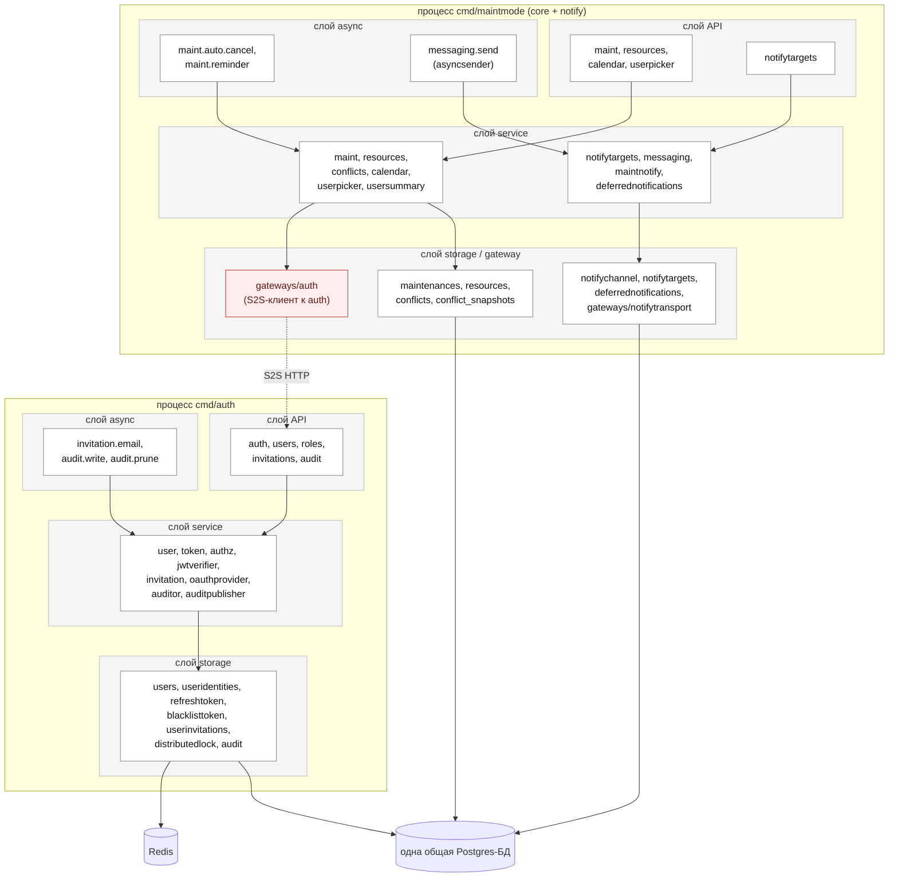
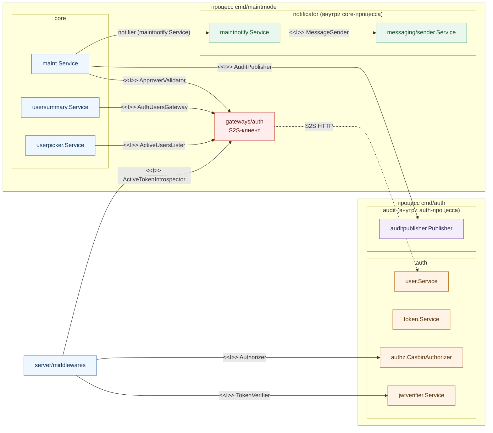

# Текущая архитектура MaintMode (as-is)

> Снимок состояния «как сейчас» — для сравнения с целевым модульным монолитом
> ([architecture.md](architecture.md)). Те же разрезы: §1 — слои × модули,
> §2 — граф пакетов и контрактов. Различия с целевым выделены в §3.

Сегодня MaintMode — это **один Go-модуль**, из которого собираются **два
бинаря**: `cmd/maintmode` (core + notify) и `cmd/auth`. Оба ходят в **одну
общую Postgres-БД**; core вызывает auth **по S2S через `internal/gateways/auth`**
(HTTP в пределах одного хоста), а не в памяти. Notify-домен (targets + доставка)
живёт **внутри core-бинаря**.

Сразу важная оговорка: **архитектура аккуратная и здоровая** — слои чистые,
модули разведены, контракты узкие. На этих диаграммах нет «грязи», которую надо
чинить. Единственное, что целевой дизайн ([architecture.md](architecture.md))
меняет, — снимает **сетевую границу core↔auth** (красный `gateways/auth` +
пунктир S2S ниже). Всё остальное переезжает один-в-один; поэтому as-is и целевой
почти неотличимы.

---

## 1. Слои × модули (as-is)

Та же сетка слоёв и модулей, что в целевом доке, но с двумя отличиями, видимыми
прямо на схеме: **граница процесса** проходит между core и auth, и core→auth
идёт через `gateways/auth` (S2S), а не прямым вызовом сервиса.

Что важно на этой схеме:

- **Две рамки процессов** (`cmd/maintmode`, `cmd/auth`) — физическая граница
  деплоя. В целевом монолите она исчезает (один процесс).
- **`gateways/auth` (красный) + пунктир `S2S HTTP`** — core не зовёт auth-сервис
  напрямую, а гоняет HTTP-запрос по сети через S2S-шлюз. Это и есть та обёртка,
  которая в монолите снимается.
- **notify в core-процессе** — `notifytargets`/`messaging`/`maintnotify`/
  `deferrednotifications` собраны в бинаре `cmd/maintmode`, не отдельно.
- **`audit` в auth-процессе** — стор `audit` и дренаж `audit.write`/`audit.prune`
  живут в auth-бинаре (исторический артефакт RUK-179).
- **Одна общая БД** — все сторы обоих процессов пишут в неё; границы данных нет.

---

## 2. Граф пакетов и контрактов (as-is)

Те же межмодульные контракты, что в целевом доке (§2.2 [architecture.md](architecture.md)),
но core→auth-рёбра реализованы **через `gateways/auth` по S2S**, а не локальным
вызовом. Сам набор интерфейсов идентичен — меняется только то, чем они
удовлетворяются.

На графе видно ключевое: **четыре core→auth-контракта** (`ApproverValidator`,
`AuthUsersGateway`, `ActiveUsersLister`, `ActiveTokenIntrospector`) сейчас идут
через `gateways/auth` и сеть, а `TokenVerifier`/`Authorizer` уже локальны
(`jwtverifier`/`authz` собраны в core-процесс). `audit.write` пересекает границу
процессов через **общую БД и общий `goque_task`** (атомарность outbox держится
только потому, что БД одна).

---

## 3. Чем as-is отличается от целевого (architecture.md)

| Аспект | as-is (этот док) | целевой монолит (architecture.md) |
| --- | --- | --- |
| Процессов | два (`cmd/maintmode`, `cmd/auth`) | один |
| core → auth | через `gateways/auth` по S2S HTTP | прямой вызов сервиса в памяти |
| `gateways/auth` | есть (S2S-клиент) | удалён |
| notify | в core-процессе | модуль в общем процессе (без изменений места) |
| audit | в auth-процессе | модуль в общем процессе |
| БД | одна общая | одна общая (без изменений) |
| `goque_task` | один общий, дренят два бинаря | один общий, дренит один процесс |

Главное: **переход меняет немного** — снимается `gateways/auth` и вторая рамка
процесса, четыре контракта переключаются с S2S на вызов в памяти. Сами
интерфейсы, сторы, БД и набор пакетов остаются те же. Это и есть аргумент
«откат дешёвый» из [architecture.md](architecture.md) §1.
