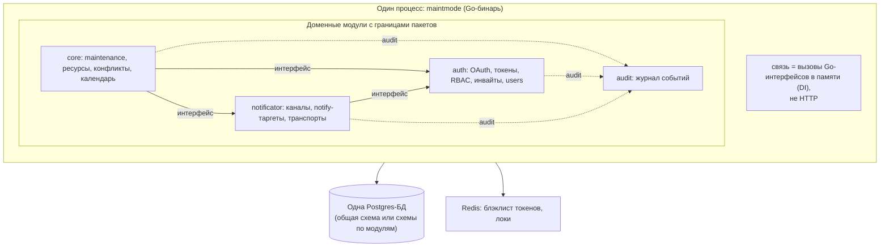
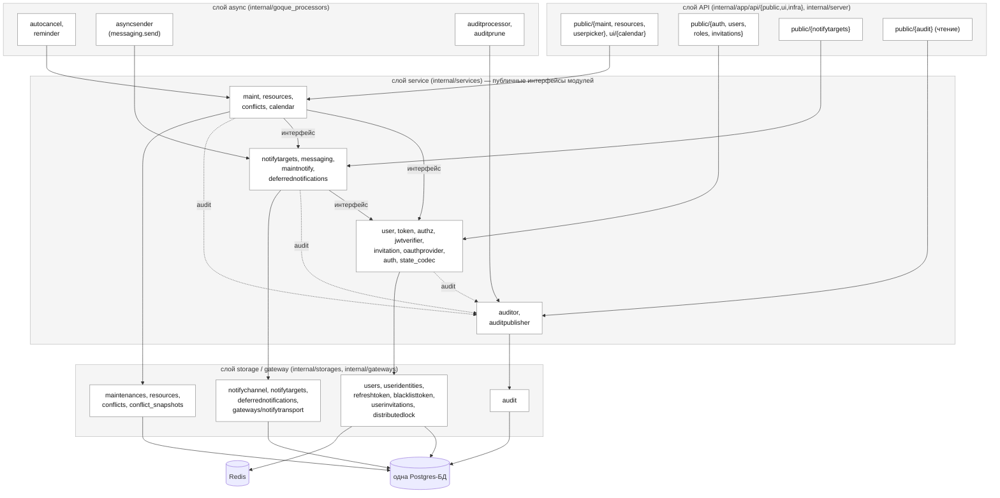
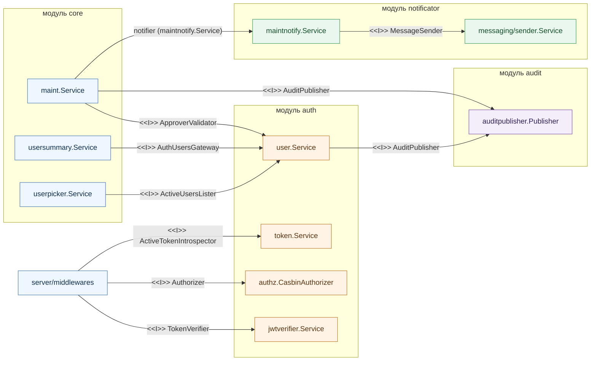
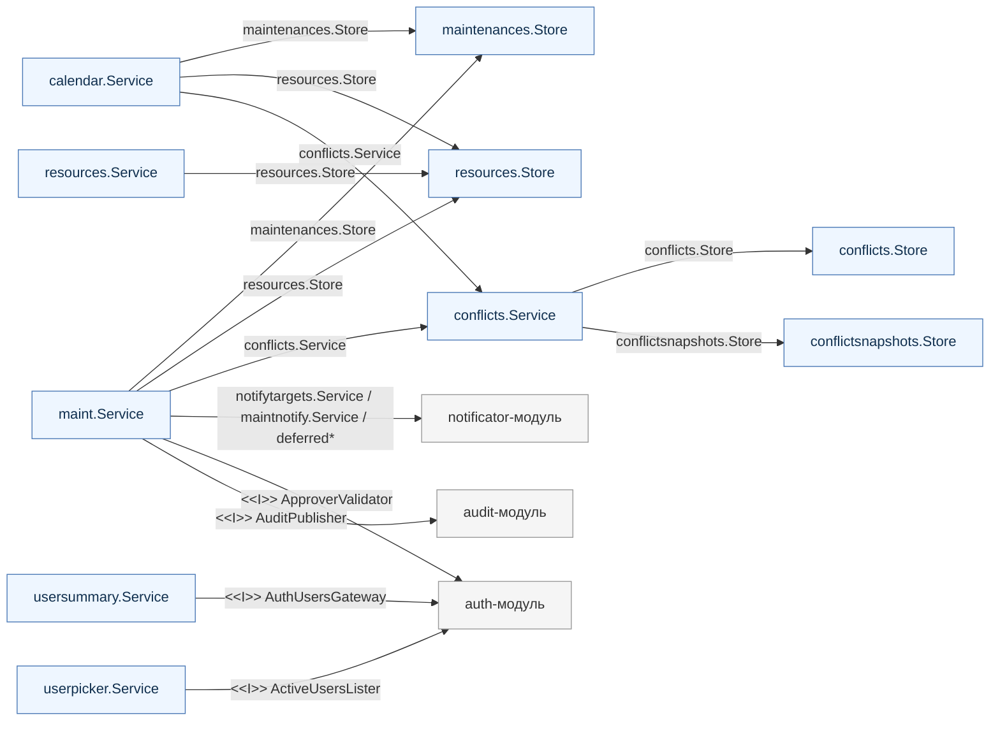
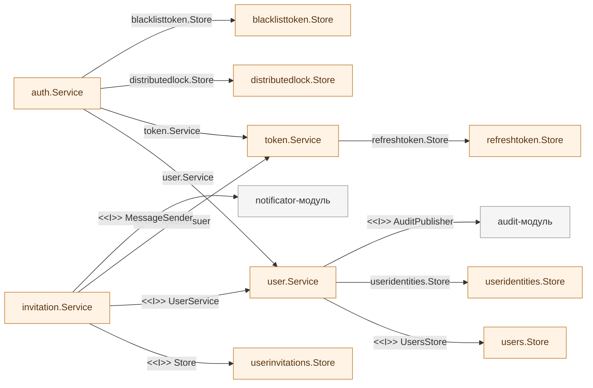
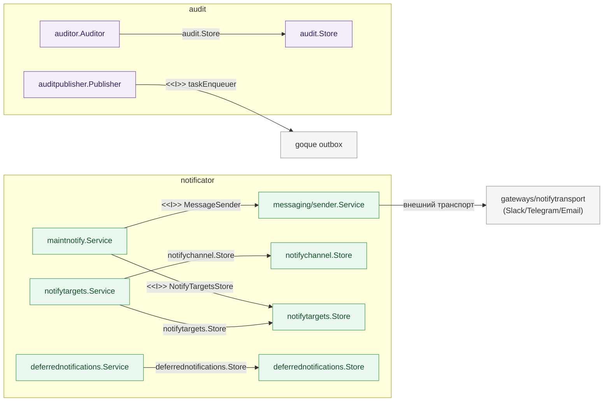

# Архитектура MaintMode: модульный монолит (à la Grafana)

> Статус: **принятый** целевой дизайн (RUK-187). Решение зафиксировано в
> [ADR-0003](../ops/adr/0003-modular-monolith-vs-services.md). Код в рамках
> RUK-187 не меняется — это дизайн.
> Linear: [RUK-187](https://linear.app/ruko/issue/RUK-187/razdelit-maintmode-na-core-auth-i-vozmozhno-notificator)

Целевая архитектура MaintMode — **модульный монолит**: один процесс, одна БД,
доменные модули (core / auth / notificator / audit) с чёткими границами пакетов,
связь — вызовы Go-интерфейсов в памяти. Полное разделение на независимые сервисы
с отдельными БД задокументировано отдельно
([service-split.md](service-split.md)) как **будущая цель по триггеру**, а не
текущее направление. Развилка и обоснование — в
[ADR-0003](../ops/adr/0003-modular-monolith-vs-services.md).

---

## 1. Контекст и решение

Изначально RUK-187 ставился как «разделить на core/auth/notificator». При
проверке оказалось, что **текущая архитектура хорошая**: слои чистые, модули
разведены, контракты между ними — узкие consumer-интерфейсы (см.
[architecture-as-is.md](architecture-as-is.md)). Менять в ней по сути нечего.

Избыточно ровно **одно решение** — что граница core↔auth проведена **по сети**
(два процесса + S2S через `gateways/auth`), хотя для текущей стадии это не
окупается: сетевой слой добавляет цену (S2S-латентность, раздельный bootstrap,
резолв юзеров по сети, атомарность аудита через общую БД), а ни один триггер
разделения (§7) не виден на горизонте. Поэтому целевое решение — **модульный
монолит**: ту же модульную структуру оставляем, убираем лишь сетевую границу —
auth схлопывается в общий процесс. Это не переписывание архитектуры, а снятие
одного избыточного слоя (диаграммы as-is и целевого почти идентичны).

Прежде чем платить за распределённую систему (S2S-латентность,
eventual consistency, перелив данных, N баз на одном VM), стоит честно
спросить: **оправдана ли эта цена на текущей стадии?**

Вводные проекта:

- **Деплой — один VM, Docker Compose + Caddy + Ansible** (`ops/`). Не Kubernetes,
  нет автоскейла, нет независимого масштабирования по сервисам.
- **Один владелец/разработчик** (ADR-0001/0002: «Deciders: Ruslan (owner)»).
  Нет нескольких команд, между которыми надо разводить кодовую базу.
- **Стадия — внутренний MVP** (milestone «P0: Production-Ready Internal MVP»).
- Нет требований к раздельным SLA, раздельной изоляции данных или
  географическому разнесению.

При таких вводных классический инженерный ответ — **монолит**. Микросервисы
окупаются независимым деплоем/масштабированием/командами; ничего из этого сейчас
нет. На одном VM «микросервисы» = несколько контейнеров с межсетевыми вызовами
вместо вызовов функций: минусы распределённой системы без её плюсов.

### Прецедент: Grafana

Grafana (OSS) — это **монолит** при огромном масштабе. Аутентификация, RBAC,
дашборды, datasources, alerting — это **модули внутри одного процесса** (Go-
интерфейсы + DI), а не сетевые сервисы. У Grafana **одна СУБД с общей схемой**
(`user`, `org`, `team`, `role`, `permission`, `dashboard`, ...) с нормальными FK
и JOIN. Модуль auth вызывает RBAC как функцию, а не по HTTP. Это доказывает, что
«авторизация + роли + доступы + домен» прекрасно живут модулями в одном бинаре
со строгим RBAC и чистыми границами — без S2S и распределённой согласованности.

> Оговорка: Grafana Labs в облаке разносит на отдельные сервисы Loki/Mimir/Tempo —
> но это **другие продукты** под технологически разные нагрузки (хранение
> TSDB/логов/трейсов), а не дробление самого Grafana-app на «auth-сервис против
> дашборд-сервиса». Сам app остаётся монолитным.

---

## 2. Целевая архитектура (модульный монолит)

Принципы:

1. **Один процесс, один бинарь.** auth сливается обратно в общий процесс
   (как `auth`/`accesscontrol` в Grafana). Меньше операционных частей.
2. **Чёткие границы модулей.** core / auth / notificator / audit — отдельные
   пакеты с явными интерфейсами; кросс-доменные вызовы идут только через эти
   интерфейсы, запрет на импорт внутренностей чужого модуля.
3. **Одна БД.** FK и JOIN внутри БД допустимы и приветствуются там, где это
   естественно (auth↔invitations, notify↔channels, notify↔maintenance,
   audit без FK как сейчас).
4. **Связь — вызовы в памяти, не S2S.** S2S-шлюз core→auth заменяется прямым
   вызовом локального сервиса.

### 2.1. Слои после перехода (UML package diagram)

Диаграмма пакетов: горизонтальные **слои** (api → service → storage/gateway → БД)
× вертикальные **модули** (core / auth / notificator / audit). Стрелка =
зависимость (`import`). Все стрелки направлены **вниз по слоям** и **через
публичный интерфейс сервиса** между модулями — это и есть граница, которую
сторожит CI-проверка импортов (§6).

**Каноническая раскладка модуль → пакеты** (источник истины для depguard-правил
в `.golangci.yaml`; выверена по коду, RUK-193). Список `storages` каждого модуля —
это ровно то, что CI запрещает импортировать из других модулей («крепость
сторов», §6):

| Модуль | `internal/services/*` | `internal/storages/*` |
| --- | --- | --- |
| **core** | `maint, resources, conflicts, calendar, userpicker, usersummary` | `maintenances, resources, conflicts, conflict_snapshots` |
| **auth** | `user, token, authz, jwtverifier, invitation, oauthprovider, auth, state_codec` | `users, useridentities, refreshtoken, blacklisttoken, userinvitations, distributedlock` |
| **notificator** | `notifytargets, messaging, maintnotify, deferrednotifications` | `notifychannel, notifytargets, deferrednotifications` |
| **audit** | `auditor, auditpublisher` | `audit` |

API (`internal/app/api`) — вложенный: `public/{maint, resources, roles, users,
auth, invitations, notifytargets, userpicker, audit}`, `ui/{calendar}`, `infra/*`.
Асинхронные процессоры — `internal/goque_processors/{autocancelprocessor,
reminderprocessor, asyncsenderprocessor, auditprocessor, auditpruneprocessor}`.
Сборка (`internal/app/bootstrap`, `internal/server`) и тест-фикстуры (`*_test.go`)
из «крепости сторов» исключены — они легитимно видят все модули.

Что изменилось относительно as-is и почему диаграмма именно такая:

- **`internal/gateways/auth/` исчезает.** Раньше `s_core` (maint) ходил в auth по
  S2S через этот пакет. В монолите ребро `s_core →|интерфейс| s_auth` — это
  прямой вызов `user`/`token`/`authz`-сервиса в памяти.
- **`gateways/notifytransport` остаётся** — это шлюз к внешним мессенджерам
  (Slack/Telegram/Email), настоящая внешняя граница, а не межмодульная.
- **Зависимости только вниз и только на интерфейс сервиса** чужого модуля. Прямой
  импорт чужого `storages`/`entity` запрещён (§6) — на диаграмме нет ни одной
  стрелки api/storage одного модуля в потроха другого.
- **`entity`, `utils` и `internal/audit`** (доменные типы, dbtx, xhttp, xtime,
  `audit.Action`/render, ...) — общий фундамент под всеми слоями; на диаграмму не
  вынесены, чтобы не зашумлять (от них зависят все, они не зависят ни от кого).
  `internal/audit` — это пакет общих audit-типов, **не** storage модуля audit
  (storage модуля audit — `internal/storages/audit`).

### 2.2. Граф пакетов и контрактов

Детализация §2.1 до **пакетов** и **интерфейсов между ними**. Узел = реальный
Go-пакет (`maint.Service`, `maintenances.Store`, `conflicts.Service`, ...).
Ребро = зависимость в конструкторе; на ребре подписано, **через что** связь:

- `<<I>> ИмяИнтерфейса` — consumer-side интерфейс (узкий контракт, объявлен у
  потребителя; подменяем в тестах и при схлопывании). **Межмодульные** связи идут
  только так.
- `*.Store` / `*.Service` — прямая типизированная зависимость на пакет того же
  модуля (внутримодульная связь, конкретный тип).

Имена и сигнатуры — фактические из кода (`internal/services/*/service.go`,
`internal/server/middlewares/*`).

#### Обзор: все межмодульные рёбра

Только связи, пересекающие границу модуля (внутримодульные `*.Store` — в
детализациях ниже). Все межмодульные рёбра — через `<<I>>`-интерфейс.

#### Детализация: модуль core

`maint.Service` — самый связный узел: внутри модуля держит сторы и сервисы
напрямую (конкретные типы), наружу ходит только через `<<I>>`-интерфейсы.

#### Детализация: модуль auth

#### Детализация: модули notificator и audit

Карта межмодульных контрактов (только рёбра через границу модуля):

| Контракт | Объявлен в | Поставщик (модуль) | После монолита |
| --- | --- | --- | --- |
| `ApproverValidator` | `services/maint` | `user` (auth) | прямой вызов вместо `gateways/auth` S2S |
| `AuthUsersGateway` | `services/usersummary` | `user` (auth) | прямой вызов вместо S2S |
| `ActiveUsersLister` | `services/userpicker` | `user` (auth) | прямой вызов вместо S2S |
| `TokenVerifier` | `server/middlewares` | `jwtverifier` (auth) | **уже локально** (`services.JWTVerifier`) |
| `Authorizer` | `server/middlewares` | `authz` (auth) | **уже локально** (`services.RBAC`) |
| `ActiveTokenIntrospector` | `server/middlewares` | `token` (auth) | прямой вызов вместо S2S |
| `MessageSender` | `services/maintnotify`, `services/invitation` | `messaging` (notificator) | без изменений |
| `NotifyTargetsStore` | `services/maintnotify` | `notifytargets.Store` (notificator) | без изменений |
| `AuditPublisher` | `services/maint`, `services/user`, `services/auth` | `auditpublisher` (audit) | без изменений (локальный outbox) |

Главное, что показывает граф: **внутри модуля** пакеты связаны конкретными типами
(`maint.Service` держит `maintenances.Store`, `resources.Store`, `conflicts.Service`
напрямую), а **через границу модуля** — только узкими `<<I>>`-интерфейсами.
Схлопывание auth трогает лишь *реализацию* `ApproverValidator`/`AuthUsersGateway`/
`ActiveUsersLister`/`ActiveTokenIntrospector` (S2S-обёртка → локальный сервис) — ни
сигнатуры, ни вызывающий код не меняются. CI-проверка импортов (§6) сторожит
именно границу модуля: межпакетная связь наружу обязана идти через `<<I>>`, а не
через прямой импорт чужого `*.Store`/`entity`.

---

## 3. Что конкретно меняется относительно текущего кода

Главное наблюдение: **разделение зашло неглубоко, откат дешёвый.**

| Сегодня | В монолите |
| --- | --- |
| Два бинаря `cmd/maintmode` + `cmd/auth` | Один бинарь `cmd/maintmode` |
| `Introspector: gateways.Auth` (S2S HTTP) | `Introspector: services.<auth>` — прямой вызов |
| `Authorizer: services.RBAC` (**уже локальный**) | без изменений |
| `TokenVerifier: services.JWTVerifier` (**уже локальный**) | без изменений |
| `GetUsersByIDs`/`ListActiveUsers`/`IsEligibleApprover` через `internal/gateways/auth` | прямой доступ к данным через `internal/services/user` (`ListUsers`/`GetByID`/`GetRoles` уже есть) + тонкая композиция шлюза переезжает в локальный вызов |
| Раздельный bootstrap (`NewAuthStores`/`NewStores`, ...) | один bootstrap собирает все модули |
| Раздельные `deployment/auth` + `deployment/maintmode` | один deployment |

Ключевой факт: **доступ к данным**, который сейчас идёт по S2S, уже есть локально
в том же репозитории — `services/user` отдаёт `ListUsers`/`GetByID`/`GetRoles`,
`services/token` — `verify_access_token`. S2S-шлюз `internal/gateways/auth/`
поверх них добавляет **тонкую композицию** (например, `IsEligibleApprover` —
это маппинг `entity.ApproverEligibleRoles` → запрос с фильтрами `active`+`roles`
→ проверка непустого результата; `check_approver.go`). При схлопывании эта
композиция переезжает в локальный метод/вызов на стороне core — это десяток строк,
не блокер. RBAC и верификация токена в core **уже** локальные (`services.RBAC`,
`services.JWTVerifier`) — их трогать не надо.

То есть откат дешёвый не потому, что методы 1:1 уже лежат локально, а потому что
вся тяжёлая часть (доступ к данным auth) локальна, а по сети ходит лишь тонкая
обёртка-композиция, которую тривиально внести обратно в процесс.

Аудит остаётся как сейчас: единый `audit_log`, outbox `audit.write` в той же БД,
один дренер. Никакого S2S-ingest и audit-плоскости с отдельной БД не нужно —
проблема атомарности через границу БД **не возникает**, потому что границы БД нет.

---

## 4. Кросс-доменные связи

В монолите все сцепления, которые были бы кросс-БД при разделении
([service-split.md](service-split.md) §6), **перестают быть проблемой**, потому
что нет границы БД:

- `maintenance_notify_targets.channel_id → messenger_channels.id` — обычный FK.
- JOIN notify-таргетов на каналы, JOIN инвайтов на users — обычные JOIN.
- `maintenance_id` FK на `maintenances` — остаётся (даже мёртвый CASCADE можно
  не трогать).
- Авторы/аппруверы — резолв через локальный вызов user-сервиса (паттерн
  `authorship-resolve-on-read` остаётся, но без сети).
- Аудит maint-событий — локальный outbox в той же tx, как сейчас.

То есть весь раздел «как развязать кросс-БД связи» из
[service-split.md](service-split.md) в монолите просто не нужен.

---

## 5. Очередь goque

Остаётся как сейчас: **один `goque_task`** в общей БД, изоляция по типу задачи
(`ProcessorTaskOwner`). Все процессоры (`messaging.send`, `maint.reminder`,
`maint.auto.cancel`, `invitation.email`, `audit.write`, `audit.prune`) живут в
одном процессе. Никакого per-service outbox и relay-outbox не требуется.

> Нюанс: в монолите изоляция по типу задачи перестаёт быть про «не уйти в чужой
> бинарь» (бинарь один) и становится просто организационной меткой владельца
> модуля. Гард type→processor и startup-verify сохраняются как защита от опечаток.

---

## 6. Сохранение возможности разделиться позже

Модульный монолит — это **не тупик**, а отложенное решение. Чёткие границы
модулей (§2) — ровно тот фундамент, с которого позже можно выделить сервис, если
появится конкретный триггер (см. §7). Это «Этап 0» из
[service-split.md](service-split.md), доведённый до самодостаточного целевого
состояния, а не до промежуточного шага.

Что для этого держать в дисциплине уже сейчас:

- кросс-доменные вызовы — только через интерфейсы модуля, не через прямой импорт
  стора/энтити чужого домена;
- автор/актор — denormalized UUID без FK (как сейчас), чтобы потом не упереться в
  кросс-БД FK;
- доменные события (аудит, notify-триггеры) — через outbox, чтобы транспорт
  можно было сменить с in-process на S2S, не меняя бизнес-логику.

### Enforcement границ — обязательный элемент, не пожелание

Главный риск модульного монолита: без сетевого барьера ничто физически не мешает
core импортнуть стор auth напрямую, и через полгода «модульный монолит»
превращается в «большой ком грязи», из которого уже не выделить сервис. Поэтому
граница должна **проверяться машиной, а не дисциплиной**:

- **Статическая проверка импортов** в CI: каждый доменный модуль
  (core/auth/notificator/audit) объявляет, что́ ему можно импортировать; импорт
  внутренностей чужого модуля (его `storages`/`entity`) — ошибка сборки.
  Разрешён только импорт публичного интерфейса модуля.
- Это та самая страховка, которая делает «разделиться позже» дешёвым: пока швы
  не размыты, выделение сервиса — механический шаг по готовой границе.

Без этого пункта весь дизайн держится на силе воли — что неприемлемо. Конкретная
реализация (отдельный linter / `depguard` в golangci / архитектурный тест)
выбирается в follow-up, но **сам факт enforcement-а — часть решения**.

---

## 7. Триггеры пересмотра (когда разделять)

Перейти к разделению на сервисы ([service-split.md](service-split.md)) имеет
смысл, когда появится **конкретный** из этих триггеров — не раньше:

- **Вторая команда**, которой нужен независимый релиз-цикл своего домена.
- **Раздельное масштабирование**: например, доставка уведомлений начинает
  упираться в ресурсы и мешает maintenance-нагрузке.
- **Требование изоляции данных** (комплаенс/аудит): identity-данные нельзя
  держать в одной БД с доменными.
- **Уход с одного VM** на оркестратор, где независимый деплой сервисов реально
  даёт выгоду.
- **Раздельные SLA / контур безопасности** для auth.

До появления такого триггера разделение — это сложность без окупаемости.

---

## 8. Сравнение вариантов

| Аспект | Модульный монолит (этот док) | Три сервиса (service-split.md) |
| --- | --- | --- |
| Процессов | один | три |
| Границы | пакеты + DI (в памяти) | сеть (S2S) |
| БД | одна | три отдельные + audit-БД |
| Кросс-доменные связи | обычные FK/JOIN | app-level + S2S, без FK |
| Аудит | единый, локальный outbox | отдельная плоскость + S2S-ingest |
| Согласованность | транзакционная | eventual между сервисами |
| Операционная цена | низкая | высокая (N БД, S2S, перелив) |
| Независимый деплой/скейл | нет | да |
| Подходит для | один VM, одна команда, MVP | многокомандность, раздельный скейл |
| Откат к другому варианту | разделиться позже (границы готовы) | слить обратно сложнее |

---

## 9. Риски модульного монолита (честно)

- **Размывание границ.** Без сетевой границы легко «срезать угол» и импортировать
  чужой стор напрямую. Лечится статической проверкой импортов (linter на
  запрещённые межмодульные импорты) — дёшево, но требует дисциплины.
- **auth снова в одном процессе с доменом.** Security-критичный модуль делит
  процесс с maintenance. Митигируется тем, что RBAC/верификация токена и так уже
  в core-процессе сегодня; контур безопасности от текущего состояния не
  ухудшается. Если это станет неприемлемо — это и есть триггер из §7.
- **Один процесс — общий радиус отказа.** Паника в notify-модуле роняет весь
  процесс. Для MVP на одном VM приемлемо (всё и так на одном VM); при росте
  требований к изоляции — триггер к разделению.

---

## 10. План перехода (если выбран этот вариант)

Существенно короче, чем в основном доке — это в основном **схлопывание**, а не
разнесение.

### Этап A. Границы модулей

Развести `internal/` по доменным неймспейсам (core/auth/notificator/audit) с
явными интерфейсами; включить запрет кросс-доменных импортов внутренностей.

- **Проверка**: `make tloc`/`make lint`; статическая проверка импортов.
- **Откат**: чистый рефакторинг пакетов.

### Этап B. Схлопнуть auth-бинарь в общий процесс

Заменить `gateways.Auth` (S2S) на прямой вызов локального user/token-сервиса в
`cmd/maintmode`; объединить bootstrap; убрать `cmd/auth` и `deployment/auth`.

- **Проверка**: `make tloc-api`; `TC-AUTH-*`, `TC-ADMIN-*`, `TC-AUTHZ-01`,
  `TC-SEC-*` (особенно guard'ы и introspection-замена) зелёные на одном бинаре.
- **Откат**: вернуть S2S-шлюз и второй бинарь (граница интерфейсов сохранена).

### Этап C. Чистка

Убрать `internal/gateways/auth/`, секции `ExternalServices`/`S2SConfig` из
конфига, S2S-инфраструктуру между core и auth.

- **Проверка**: сборка, полный прогон тестов; smoke на одном процессе.
- **Откат**: реверс коммитов.

> Аудит, notify и goque-очередь на этом пути **не трогаются** — они и так
> корректно работают в одном процессе с одной БД.

---

## 11. Рекомендация

Для текущей стадии (один VM, один владелец, внутренний MVP) **рекомендуется этот
вариант — модульный монолит**. Он даёт чистые границы (главную ценность, ради
которой и затевалось RUK-187) без операционной цены распределённой системы, и
сохраняет возможность разделиться позже по конкретному триггеру. Полное
разделение на сервисы из [service-split.md](service-split.md) остаётся
задокументированной целью «на когда появится триггер из §7».
