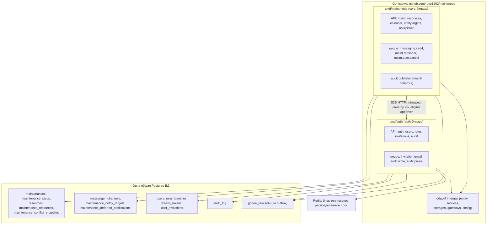
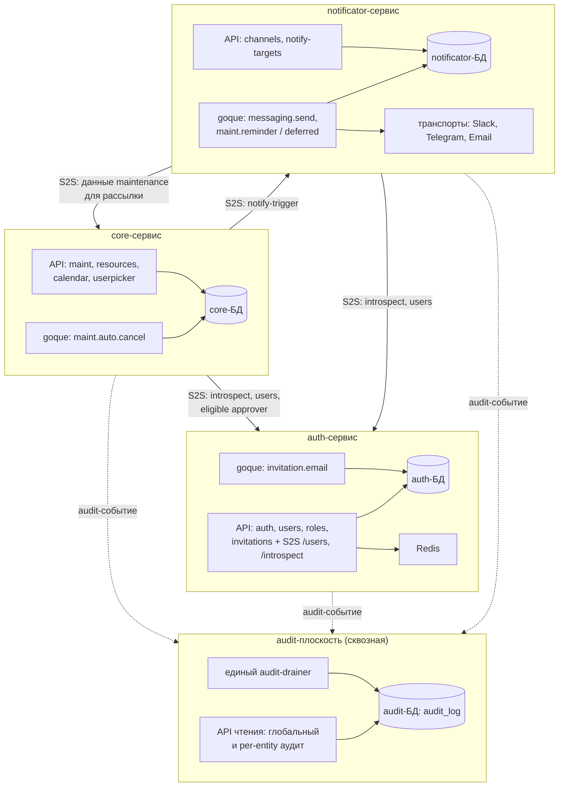

# Разделение MaintMode на сервисы: core, auth, notificator

> ⚠️ **Это НЕ текущее направление.** По [ADR-0003](../ops/adr/0003-modular-monolith-vs-services.md)
> принят **модульный монолит** ([architecture.md](architecture.md)). Этот документ
> сохранён как **будущая цель «по триггеру»**: к нему возвращаются, только когда
> сработает один из триггеров разделения ([architecture.md](architecture.md) §7 —
> вторая команда, раздельный скейл, изоляция данных, уход с одного VM). До тех пор
> разделять не нужно.
>
> Статус: отложенный проект архитектуры (RUK-187). Код не меняется.
> Linear: [RUK-187](https://linear.app/ruko/issue/RUK-187/razdelit-maintmode-na-core-auth-i-vozmozhno-notificator)

Документ фиксирует **возможную будущую** архитектуру разделения бэкенда MaintMode
на независимые сервисы и **поэтапный план миграции** к ней — на случай, когда
появится триггер. Истина по именам таблиц, типам задач и S2S-методам — в
репозитории `maintmode`; здесь они приводятся как опорные точки дизайна.

---

## 1. Контекст и цель

### Что есть сейчас (as-is)

Бэкенд `maintmode` — это **один Go-модуль** (`github.com/ruko1202/maintmode`) с
общим деревом `internal/`, из которого собираются **два бинаря**:

- `cmd/maintmode` — core: maintenance-домен, ресурсы, конфликты, календарь, а
  также — пока — notify-таргеты и доставка уведомлений.
- `cmd/auth` — identity: OAuth-логин, токены, RBAC, инвайты, аудит-стор.

Оба бинаря ходят в **одну общую Postgres-базу** и делят одну таблицу
transactional outbox `goque_task` (изоляция по типу задачи). Рантайм-граница уже
существует: core вызывает auth по S2S-шлюзу (`internal/gateways/auth/`).

Чего **нет**: границы данных. Таблицы трёх доменов лежат в одной БД, между ними
есть FK и JOIN-ы через доменную границу, единый `audit_log` исторически «привязан»
к auth.

### Зачем разделять

Цель — независимые сервисы с собственными БД, чтобы:

- катить и масштабировать core / auth / notificator по отдельности;
- ограничить радиус отказа (падение notify-транспортов не задевает maintenance);
- сделать владение данными явным (кто пишет в таблицу — тот и владеет ею).

### Целевое решение (зафиксировано в ADR-0003)

- **Три доменных сервиса**: core, auth, notificator.
- **Отдельная физическая БД на каждый сервис**; кросс-сервисный доступ — только
  через S2S API. Никаких кросс-БД FK и кросс-БД JOIN.
- **Аудит — отдельная сквозная плоскость** с собственной БД (не домен auth).
- **notificator проектируется сейчас, извлекается позже** (отсюда «возможно» в
  названии задачи). На первом шаге извлекается auth; core+notificator временно
  остаются в одном бинаре с уже разведёнными внутренними границами.

### Рамки RUK-187

Эта задача — **только дизайн**. Код, миграции и генерируемые клиенты не
меняются. Извлечение реализуется в follow-up задачах (раздел 13).

---

## 2. Текущая архитектура (as-is)

Ключевые наблюдения as-is:

- Core пишет и в maintenance-таблицы, и в notify-таблицы, и в общий `goque_task`.
- `audit_log` пишется **всеми** доменами через outbox, но дренится **только**
  auth-бинарём (`audit.write` processor). Это работает лишь потому, что
  `goque_task` и `audit_log` — в одной БД (атомарность outbox).
- notify-домен **физически размазан** по core-бинарю: API `notifytargets`,
  процессоры `messaging.send` и `maint.reminder` и реестр транспортов
  (`internal/gateways/notifytransport`) живут внутри core.

---

## 3. Целевая архитектура (to-be)

Принципы целевой картины:

1. **Своя БД у каждого сервиса.** Доступ к чужим данным — только S2S.
2. **Аудит — отдельная плоскость**, а не таблица внутри auth. Единый `audit_log`
   в audit-БД; все сервисы пишут в неё через общий audit-outbox; один дренер.
   Это единственное исключение из правила «свой outbox у каждого сервиса»
   (раздел 8).
3. **Авторы и аппруверы** хранятся в core как denormalized UUID без FK;
   человекочитаемые поля резолвятся через auth S2S на чтении (паттерн
   `authorship-resolve-on-read`).
4. **Notify-таргеты ссылаются на каналы** в пределах одной notificator-БД (FK
   остаётся внутри сервиса), а на maintenance — через app-level ссылку и S2S.

---

## 4. Границы сервисов

### core (maintenance-домен)

- **Владеет**: жизненным циклом maintenance, шагами, ресурсами, связями
  maintenance↔resource, снапшотами конфликтов; детектом конфликтов
  (`tstzrange` + GiST); календарём; user-picker (проксирует список в auth).
- **API**: `maint`, `resources`, `calendar`, `userpicker`.
- **goque**: `maint.auto.cancel` (+ cron-вариант).
- **Зависит от**: auth (S2S: introspect, users-by-ids, eligible-approver),
  notificator (S2S: триггер уведомлений). Публикует audit-события.

### auth (identity-домен)

- **Владеет**: пользователями, OAuth-идентичностями, refresh-токенами, блэклистом
  токенов, инвайтами, RBAC-политиками; Redis (блэклист, локи).
- **API**: `auth`, `users`, `roles`, `invitations` + S2S-поверхность
  (`/api/v1/s2s/users`, introspection).
- **goque**: `invitation.email`.
- **Зависит от**: ничего из доменов (auth самодостаточен). Публикует
  audit-события.

### notificator (домен доставки уведомлений)

- **Владеет**: каналами (`messenger_channels`), notify-таргетами
  (`maintenance_notify_targets`), отложенными уведомлениями
  (`maintenance_deferred_notifications`), реестром транспортов (Slack, Telegram,
  Email).
- **API**: каналы, notify-таргеты (то, что сейчас отдаёт `notifytargets`).
- **goque**: `messaging.send`, `maint.reminder`, обработка deferred-уведомлений.
- **Зависит от**: core (S2S: данные maintenance для тела уведомления — название,
  время, статус), auth (S2S: разрешение получателей/пользователей). Публикует
  audit-события.

### audit (сквозная плоскость, не доменный сервис)

- **Владеет**: единым `audit_log` в audit-БД.
- **Содержит**: единый audit-drainer и API чтения (глобальный аудит + per-entity).
- **Все три доменных сервиса** пишут в неё через общий audit-outbox.

---

## 5. Владение данными

Сопоставление таблиц с сервисами в целевой архитектуре. Источник истины по
схемам — `migrations/` в `maintmode`.

| Таблица | Сервис | Миграция | Заметки |
| --- | --- | --- | --- |
| `maintenances` | core | `20260105172956_maintenances.sql` | `approver_user_id`, `created_by_user_id` — UUID без FK |
| `maintenance_steps` | core | `20260410110000_maintenance_steps.sql` | FK на `maintenances` (внутри core) |
| `resources` | core | `20260105174000_resources.sql` | `created_by/updated_by_user_id` — UUID без FK |
| `maintenance_resources` | core | `20260105175404_maintenance_resources.sql` | FK на `maintenances`, `resources` (внутри core) |
| `maintenance_conflict_snapshot` | core | `20260215153851_conflict_snapshots.sql` | FK на `maintenances` (внутри core) |
| `messenger_channels` | notificator | `20260603120000_messenger_channels.sql` | `created_by/updated_by_user_id` — UUID без FK |
| `maintenance_notify_targets` | notificator | `20260528140313_maintenance_notify_targets.sql` (FK перенаправлён в `20260611130000_notify_targets_channel_fk.sql`) | FK на `messenger_channels` (внутри notificator); ссылка на `maintenance_id` становится app-level |
| `maintenance_deferred_notifications` | notificator | `20260529180000_maintenance_deferred_notifications.sql` | ссылка на `maintenance_id` становится app-level |
| `users` | auth | `20260318182443_users.sql` | |
| `user_identities` | auth | `20260602183138_user_identities.sql` | FK на `users` (внутри auth) |
| `refresh_tokens` | auth | `20260318182554_refresh_tokens.sql` | FK на `users` (внутри auth) |
| `user_invitations` | auth | `20260603120001_user_invitations.sql` | FK на `users` (внутри auth) |
| `audit_log` | **audit-плоскость** | `20260408083838_audit.sql` | без FK; `actor_id`/`entity_id` — TEXT (денормализовано) |
| `goque_task` | по копии на сервис | `20260526135303_goqueue_tasks.sql` | у каждого сервиса свой outbox; отдельный — у audit-плоскости |

Распределённые локи (`distributedlock`) и блэклист — инфраструктура auth (Redis).

---

## 6. Кросс-доменные связи и их разрешение

Это — главный риск разделения БД. Перечислены все текущие сцепления через
доменную границу и стратегия для целевого состояния.

### 6.1. FK `maintenance_notify_targets.channel_id → messenger_channels.id`

`migrations/20260611130000_notify_targets_channel_fk.sql`. **Не проблема**: обе
таблицы уходят в **notificator**, FK остаётся внутри одной БД сервиса.

### 6.2. JOIN notify-таргетов на `messenger_channels`

`internal/storages/notifytargets/list.go` — INNER JOIN при рассылке (резолв
транспорта, адреса, имени канала). **Не проблема**: обе таблицы — в notificator,
JOIN остаётся внутрисервисным.

### 6.3. Ссылка notify-таргетов/deferred на `maintenances`

Сейчас в схеме стоит FK `maintenance_id → maintenances(id) ON DELETE CASCADE`
(`migrations/20260528140313_maintenance_notify_targets.sql:6`,
`20260529180000_maintenance_deferred_notifications.sql:16`). После разделения
maintenance уезжает в core, а таргеты/deferred — в notificator → **кросс-БД FK,
запрещён**.

**Важный факт: каскад фактически мёртв.** Жёсткого `DELETE` строки maintenance в
системе нет — есть только **отмена** как статусный переход
(`internal/services/maint/cancel_maint.go`: `Status = MaintenanceStatusCancelled`,
строка не удаляется). Поэтому `ON DELETE CASCADE` на notify/deferred **никогда не
срабатывает**; это защитная декларация, а не рабочий сценарий. Связь maintenance
поддерживается двумя реальными механизмами:

1. **Статус при рассылке** — notify-таргеты живут и при отменённом maintenance;
   актуальный статус/время/название резолвятся в момент отправки.
2. **Явная отмена напоминаний** — при отмене maintenance core вызывает
   `deferred.Cancel(maintID)` (`update_maint.go:303`), это явная команда, а не
   каскад БД.

**Разрешение в целевой архитектуре:**
- `maintenance_id` хранится в notificator как UUID **без FK** (app-level ссылка) —
  ровно как авторы/аппруверы в core (6.4). FK `ON DELETE CASCADE` снимается без
  потери поведения, потому что он и так не работал.
- Явный вызов `deferred.Cancel(maintID)`, который сейчас внутрисервисный,
  становится **S2S-ребром core→notificator** («maintenance отменён → погаси
  напоминания»). Это durable-триггер (outbox+S2S с ретраями), формализуется в
  follow-up; страховка от потери события — фоновая сверка orphan-напоминаний
  (`notify-targets-fk-not-snapshot`).
- Тело уведомления (название, время, статус maintenance) notificator получает
  по **S2S от core**, а не JOIN-ом.

> Поскольку удаления maintenance нет, миграция связи безопаснее, чем кажется:
> снятие FK не меняет ни одного существующего пути выполнения, а единственная
> реальная команда («отмени напоминания») просто меняет транспорт с
> внутрисервисного на S2S.

### 6.4. Авторы / аппруверы maintenance и ресурсов

`maintenances.approver_user_id`, `created_by_user_id`; `resources.*_user_id`.
Уже сейчас это UUID **без FK**, человекочитаемые поля резолвятся через auth S2S
(`internal/gateways/auth/get_users_by_ids.go`, паттерн
`authorship-resolve-on-read`). **Готово к разделению** без изменений модели:
деградация до «Unknown user» уже предусмотрена. Инвариант
`no-nil-safe-actor-degradation` сохраняется: обязательный актор по-прежнему
обязателен.

### 6.5. Eligible-approver проверка

`internal/gateways/auth/check_approver.go` — S2S-вызов core→auth. **Готово**.

### 6.6. INNER JOIN инвайтов на `users`

`internal/storages/userinvitations/list.go`. **Не проблема**: обе таблицы — в
auth.

### 6.7. Аудит maintenance-событий

Core публикует `audit.write` для maint-событий (создание, смена статуса, отмена,
правка — RUK-182), пишет их auth-процессор. После разделения это **кросс-БД
запись в очередь** (атомарность outbox ломается через границу БД).

**Разрешение** — раздел 9 (аудит как отдельная плоскость).

---

## 7. S2S-контракты

### Существующие (core → auth)

Из `internal/gateways/auth/` (`gateway.go`, конфиг `ExternalServices`):

| Метод | Эндпоинт | Назначение |
| --- | --- | --- |
| `Introspect(token)` | `/api/v1/s2s/introspect` | верификация access-токена в middleware |
| `GetUsersByIDs(ids)` | `GET /api/v1/s2s/users?ids=...` | батч-резолв профилей (имена авторов/аппруверов) |
| `ListActiveUsers(q)` | `GET /api/v1/s2s/users?active=true` | список активных (user-picker, eligibility) |
| `IsEligibleApprover(id)` | `GET /api/v1/s2s/users?...&active=true&roles=...` | валидация назначаемого аппрувера |

Транспорт: `xhttp.NewClient(xhttp.WithS2S(appName, secret), xhttp.WithTimeout)`.
Конфиг — секция `ExternalServices` (у core) против `S2SConfig` (у auth).

### Новые рёбра (целевые)

| Ребро | Назначение | Заметки |
| --- | --- | --- |
| notificator → auth | introspect, резолв получателей/пользователей | переиспользует существующую S2S-поверхность auth |
| core → notificator | триггер уведомления (maintenance создан/изменён/отменён) | заменяет внутрисервисный вызов; durable-триггер через outbox+S2S |
| notificator → core | данные maintenance для тела уведомления | заменяет JOIN на `maintenances`; read-only S2S |

Каждое новое ребро должно использовать тот же S2S-механизм (заголовки,
идемпотентность), что и core→auth.

---

## 8. Очередь goque

### Сейчас

Общий `goque_task`, изоляция по типу задачи (`ProcessorTaskOwner` в
`internal/entity/goque_processors_task.go`). Владельцы по типам:

| Тип задачи | Владелец сейчас | Целевой сервис |
| --- | --- | --- |
| `messaging.send` | maintmode | **notificator** |
| `maint.reminder` | maintmode | **notificator** |
| `maint.auto.cancel` (+ `.cron`) | maintmode | **core** |
| `invitation.email` | auth | **auth** |
| `audit.write` | auth | **audit-плоскость** |
| `audit.prune` (+ `.cron`) | auth | **audit-плоскость** |

### Целевое состояние

- **У каждого сервиса — свой `goque_task` в своей БД** (свой outbox, свой
  registry, свои процессоры). Изоляция по типу задачи остаётся как защита от
  чужого типа, но физическая граница теперь — отдельная БД.
- **Audit-плоскость — отдельный потребитель со своим outbox.** У audit-БД свой
  `goque_task`, который дренит её собственный процессор. Доменные сервисы в него
  **не пишут** и коннекта к audit-БД не имеют: у каждого сервиса свой
  **локальный relay-outbox** (событие пишется в свою БД в той же tx), а
  relay-процессор доставляет его в audit-плоскость **только через S2S-ingest**
  (`POST /api/v1/s2s/audit`). То есть единый журнал достигается единой точкой
  назначения по S2S, а не общим outbox-ом или общим доступом к БД (раздел 9).

---

## 9. Аудит в разрезе сервисов

### Проблема

Единый `audit_log` сегодня «принадлежит» auth — это **исторический артефакт**
(auth первым получил outbox в RUK-179), а не доменное решение. В нём лежат
maint-события, что концептуально неверно («auth хранит данные про maintenance»).
После разделения БД core/notificator физически не могут писать в outbox auth в
одной транзакции.

### Решение: аудит — отдельная сквозная плоскость со своей БД

- `audit_log` живёт в **выделенной audit-БД**, не принадлежащей ни одному
  доменному сервису.
- Каждый сервис (core, auth, notificator) при доменном действии пишет
  audit-событие в **свой локальный relay-outbox** (`audit.write`) в той же tx;
  relay-процессор доставляет его в audit-плоскость через S2S-ingest (раздел 8,
  подробности — ниже в «Атомарность»). Прямого доступа к audit-БД у сервисов нет.
- **Один audit-drainer** дренит очередь и пишет в `audit_log`. Идемпотентность —
  по существующему `event_id`. `occurred_at → created_at`, payload = снапшот
  (как в RUK-179).
- **Чтение**: единый глобальный аудит и per-entity аудит обслуживаются
  API audit-плоскости напрямую из audit-БД — **без S2S fan-out** по сервисам.
  Это сохраняет продуктовую фичу глобальной страницы аудита
  (`test-cases/cases/TC-AUDIT-02-global-audit.md`).
- `audit.prune` (ретенция, RUK-180) переезжает на audit-плоскость вместе со
  стором.

### Атомарность при разделении БД

Чтобы запись в audit-outbox оставалась атомарной с доменной транзакцией, у
доменного сервиса остаётся **локальный outbox-релей**: сервис пишет
audit-событие в свой локальный outbox в той же tx, а релей-процессор
переносит его в audit-плоскость.

**Жёсткое правило (зафиксировано): доступ к audit-БД — только через S2S-ingest.**
Доменные сервисы (core, auth, notificator) **физически не имеют коннекта к
audit-БД** и не знают её схему: релей-процессор делает только HTTP-вызов
`POST /api/v1/s2s/audit` к audit-плоскости, а та сама пишет в `audit_log`. Это
снимает сам соблазн `SELECT`/`INSERT` в чужую БД и позволяет менять схему
audit-БД независимо. Вариант «прямая запись в общий audit-outbox чужой БД»
**отвергнут** именно ради жёсткости границы. Идемпотентность ingest — по
существующему `event_id`.

### Где это касается существующих инвариантов памяти

- `eventbus-outbox-multi-renderer` (RUK-179): audit через явный publisher,
  запись после коммита, гард type→processor, startup verify — переносится в
  audit-плоскость.
- `audit-retention-on-auth-binary` (RUK-180): дренер ретенции переезжает с
  auth-бинаря на audit-плоскость.
- `maint-audit-trail-ruk182`: maint-события (`maintenance.updated`, before/after
  diff, auto-cancel = system-актор) теперь публикуются core в свой outbox →
  релей в audit-плоскость.

---

## 10. Конфигурация и деплой

### Конфиг по сервисам

Сейчас `LoadAppConfig` (core) и `LoadAuthAppConfig` (auth) грузят один
`AppConfig`, каждый использует своё подмножество секций
(`internal/config/config.go`). Целевое:

| Секция | core | auth | notificator | audit |
| --- | --- | --- | --- | --- |
| `App` (FrontendURL, TTL) | ✓ | ✓ | ✓ | — |
| `DB` | своя core-БД | своя auth-БД | своя notif-БД | своя audit-БД |
| `Redis` | — | ✓ | — | — |
| `JWTVerifier` | ✓ | ✓ | ✓ | ✓ (для S2S/чтения) |
| `RBAC` | ✓ | ✓ | ✓ | ✓ (чтение аудита) |
| `OauthProviders`, `JWT` | — | ✓ | — | — |
| `S2SConfig` (отдаёт S2S) | — | ✓ | ✓ | ✓ (ingest) |
| `ExternalServices` (зовёт S2S) | auth, notificator | — | auth, core | — |
| `NotifyTransport` | — | — | ✓ | — |
| `TaskProcessor` | maint.auto.cancel | invitation.email | messaging/reminder | audit.write/prune |

### Деплой

- Деплой остаётся single-VM Docker Compose + Caddy + Ansible (`maintmode-deploy`).
  Каждый новый сервис = свой compose-сервис, свой каталог в `deployment/`.
- Отдельные БД provision-ятся как отдельные базы (или отдельные инстансы) —
  раздел плана миграции учитывает provisioning audit-БД и notificator-БД.
- **Expand-contract** — обязательное правило миграций
  ([ops/rolling-deploy.md](../ops/rolling-deploy.md)): сначала добавляем новое
  (новая БД, дублирующая запись), потом переключаем чтение, потом убираем старое.

---

## 11. План миграции (поэтапный)

Порядок продиктован зависимостями, не важностью. Каждый этап — со своей
**Проверкой** и **Откатом**. Извлечение auth идёт первым (наименее связан),
notificator — последним. Везде действует expand-contract.

### Этап 0. Внутренние границы пакетов (подготовка, без новых БД)

Развести `internal/` по трём доменным неймспейсам так, чтобы core, auth и
notificator не делили доменные пакеты (общими остаются только utils/config/
entity-примитивы). Зафиксировать запрет кросс-доменных импортов.

- **Проверка**: `make tloc`/`make lint`; статическая проверка отсутствия
  кросс-доменных импортов; CI-тест полноты `ProcessorTaskOwner`.
- **Откат**: чисто рефакторинг пакетов — откатывается реверсом коммитов.

### Этап 1. Аудит-плоскость и своя БД

Вынести `audit_log`, audit-store, `audit.write`/`audit.prune` процессоры и API
чтения аудита в отдельную плоскость с audit-БД. Ввести S2S-ingest. Доменные
сервисы пишут audit-событие в локальный outbox → релей в audit-плоскость.

- **Expand**: поднять audit-БД и плоскость; включить двойную запись (старый путь
  auth-дренера + новый релей) до сверки.
- **Проверка**: `TC-AUDIT-01`, `TC-AUDIT-02` зелёные на новом пути; сверка
  количества событий старый/новый путь; идемпотентность по `event_id`.
- **Contract**: отключить старый auth-дренер `audit.write`, убрать `audit_log` из
  auth-БД после успешной сверки.
- **Откат**: вернуть чтение/запись на auth-дренер; audit-БД оставить пустой.

### Этап 2. Извлечение auth в свою БД и сервис

Перенести `users`, `user_identities`, `refresh_tokens`, `user_invitations`,
RBAC, Redis в auth-БД/сервис. Core уже ходит в auth по S2S — рантайм-контракт не
меняется.

- **Expand**: поднять auth-БД; реплицировать/перелить auth-таблицы; auth-сервис
  читает из новой БД, core продолжает звать S2S.
- **Проверка**: `TC-AUTH-*`, `TC-ADMIN-*`, `TC-AUTHZ-01`, S2S-тесты
  (`TC-SEC-09`, `TC-SEC-10`); core-флоу с резолвом авторов
  (`authorship-resolve-on-read`).
- **Contract**: убрать auth-таблицы из общей БД; core-БД больше не содержит
  identity-данных.
- **Откат**: переключить auth-сервис обратно на общую БД (данные ещё там до
  contract-шага).

### Этап 3. Core на своей БД

Оставшиеся в общей БД core-таблицы (`maintenances`, `steps`, `resources`,
`maintenance_resources`, `conflict_snapshot`) — это и есть core-БД. Фактически
общая БД становится core-БД после выноса auth (этап 2) и notify (этап 4).

- **Проверка**: `TC-MAINT-*`, `TC-RES-*`, `TC-CONF-*`, `TC-CAL-*`, `TC-STEP-01`;
  детект конфликтов (`tstzrange`/GiST) не задет.
- **Откат**: на этом этапе схема core не двигается физически — риск минимален.

### Этап 4. Извлечение notificator в свою БД и сервис

Перенести `messenger_channels`, `maintenance_notify_targets`,
`maintenance_deferred_notifications`, реестр транспортов и процессоры
`messaging.send`/`maint.reminder` в notificator. Заменить FK/JOIN на
`maintenances` (раздел 6.3) на app-level ссылку + S2S. Ввести рёбра
core→notificator (триггер) и notificator→core (данные maintenance).

- **Expand**: поднять notificator-БД и сервис; перелить notify-таблицы; ввести
  S2S-триггер от core параллельно текущему внутрисервисному пути.
- **Проверка**: `TC-NOTIF-01` (каналы), `TC-NOTIF-02` (deferred/reminders);
  отмена maintenance гасит отложенные напоминания через S2S-триггер
  (`deferred.Cancel`), а не каскад БД; notify-таргеты при отмене сохраняются
  (статус резолвится при рассылке).
- **Contract**: убрать notify-таблицы и notify-процессоры из core; снять
  кросс-БД FK.
- **Откат**: вернуть notify в core-бинарь (таблицы ещё в core-БД до contract).

### Этап 5. Свои outbox-таблицы и чистка

Развести `goque_task` по БД сервисов; убрать общий `goque_task` из core-БД (кроме
audit-outbox в audit-плоскости). Финальная проверка изоляции типов задач.

- **Проверка**: каждый сервис дренит только свои типы; CI-тест полноты владельцев;
  ни один тип не уходит в чужой бинарь.
- **Откат**: вернуть общий outbox (типовая изоляция всё ещё защищает).

---

## 12. Риски и открытые вопросы

- **Отмена напоминаний через границу БД** (6.3): удаления maintenance нет, так
  что снятие FK безопасно; реальный риск — durable-доставка S2S-команды «отмени
  напоминания» и обработка потерянных событий (orphan-напоминания). Нужен
  durable-триггер + фоновая сверка. Связано с `notify-targets-fk-not-snapshot`.
- **Релей audit-событий** (9): механизм зафиксирован — только S2S-ingest, без
  доступа доменных сервисов к audit-БД. В follow-up — реализация ingest-эндпоинта
  и relay-outbox, а не выбор подхода.
- **Перелив данных** между БД на этапах 2/4: онлайн-миграция под expand-contract,
  сверка контрольных сумм; держаться правила «down -v не трогает чужой volume».
- **Согласованность во времени**: при чтении тела maintenance из core
  notificator может получить устаревшие данные — допустимо для уведомлений,
  зафиксировать как осознанный компромисс.
- **Рост числа S2S-вызовов**: новые рёбра увеличивают сетевой трафик; смягчается
  батчингом (`GetUsersByIDs`) и кэшированием на чтении.

---

## 13. Follow-up задачи

Заводятся после ревью этого документа (создание — по запросу владельца):

1. **Этап 0**: развести `internal/` по доменным неймспейсам + запрет
   кросс-доменных импортов.
2. **Этап 1**: audit-плоскость + audit-БД + S2S-ingest + перенос
   `audit.write`/`audit.prune`.
3. **Этап 2**: auth-БД + извлечение auth-сервиса.
4. **Этап 3**: фиксация core-БД.
5. **Этап 4**: notificator-БД + извлечение notificator + рёбра core↔notificator,
   замена кросс-БД FK.
6. **Этап 5**: per-service outbox + финальная чистка `goque_task`.

Каждая follow-up задача несёт свои гейты (`make tloc`, `make tloc-api`) и
соответствующие тест-кейсы из `test-cases/`.
